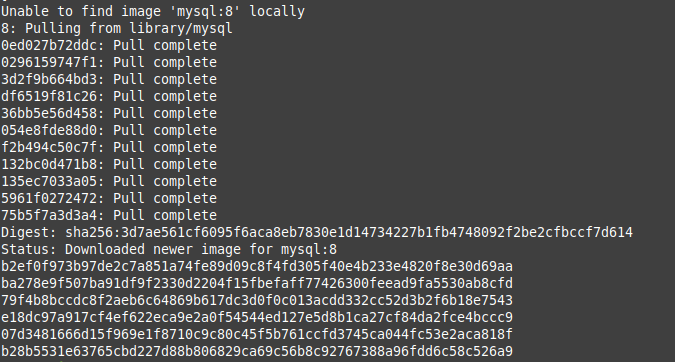
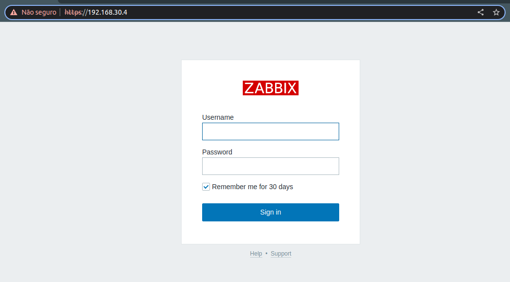
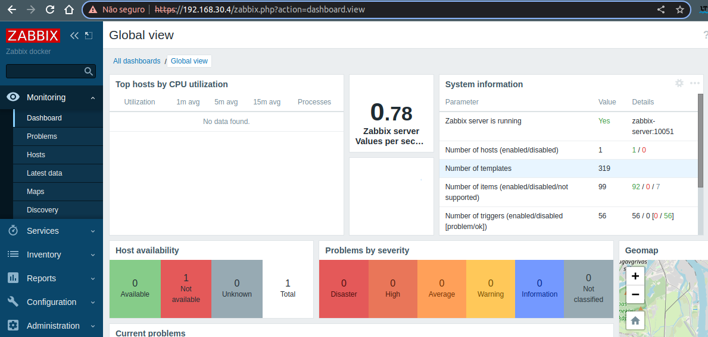

# Script to automate zabbix installation by docker

## Description
How to install zabbix with https using docker

## Instalation
Make sure docker was instalad.

```
#Execute this command in your server with docker alrady installed

sudo ./zabbix-install.sh

```








